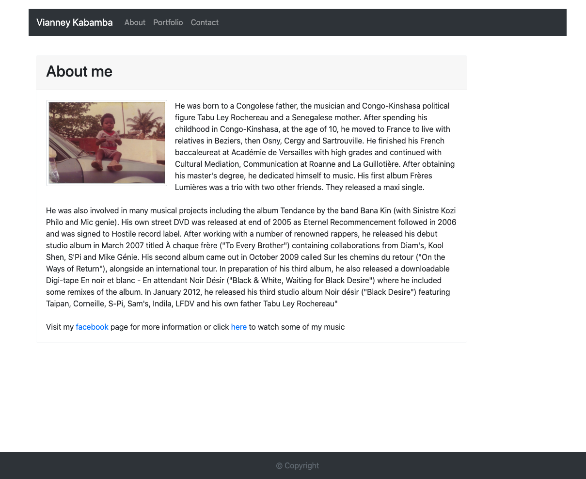
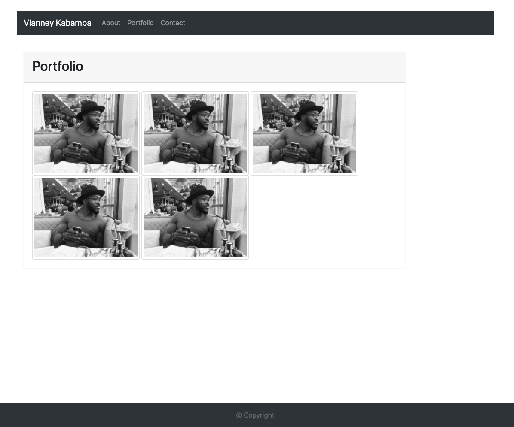
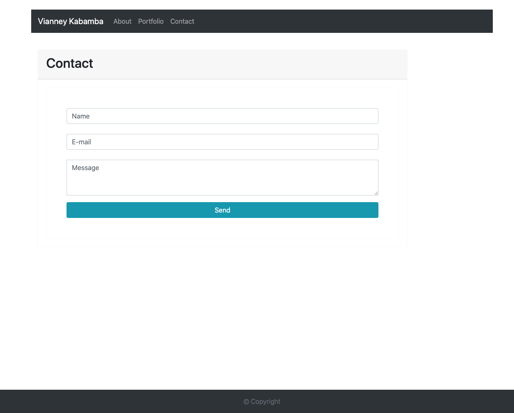

# Document for Responsive Portfolio

I created three functioning webpages which using Boostrap. The websites have navbars that contain three links to About/Portfolio/Contact. The pages also have a main content as well as a footer as the images demonstrate.

When either of these links is pressed, it will then navigate to the corresponding webpage.

In the "about me" page, I decided to talk about my favourite artist and I've attached links to his social media and music video.

In the "portfolio" page, I've uploaded five images. The images changes position fit in the screen if viewed on different devices

In the "contact" page, I've created a contact form that users can fill in with their name, email and a message.

Here are the lonks to the webpages 

file:///Users/VianneyK/Responsive%20Portfolio-Homework/index.html#
file:///Users/VianneyK/Responsive%20Portfolio-Homework/portfolio.html#
file:///Users/VianneyK/Responsive%20Portfolio-Homework/contact.html#